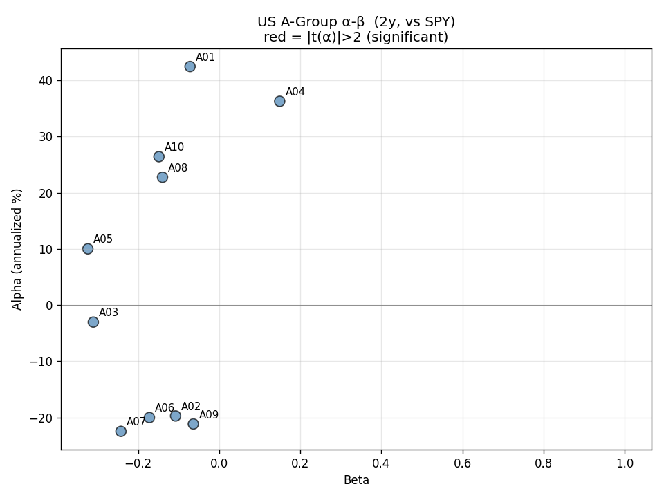
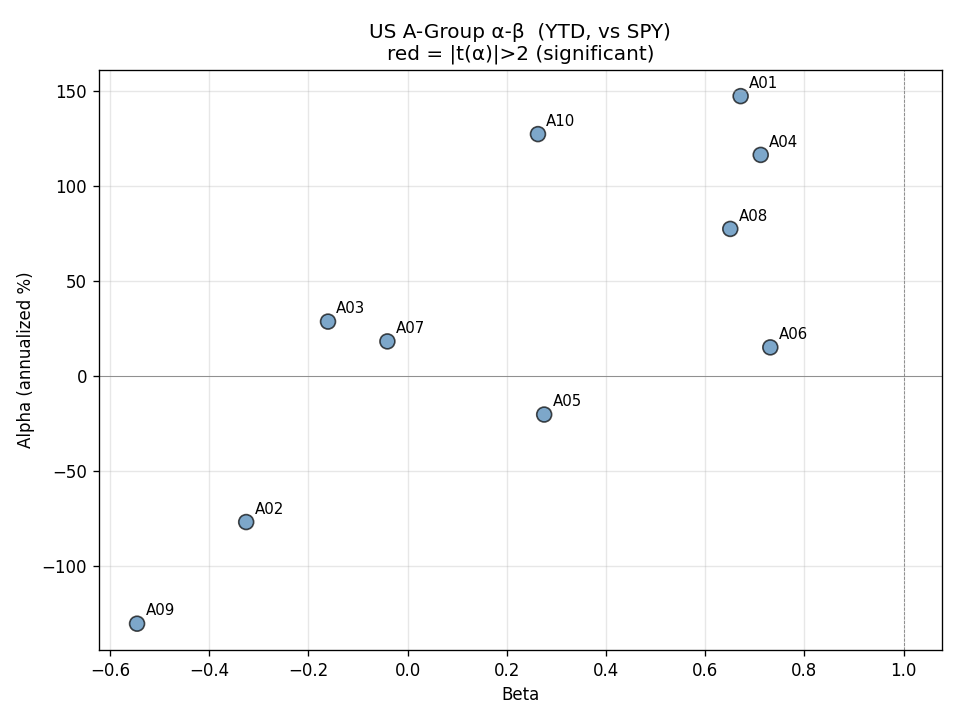
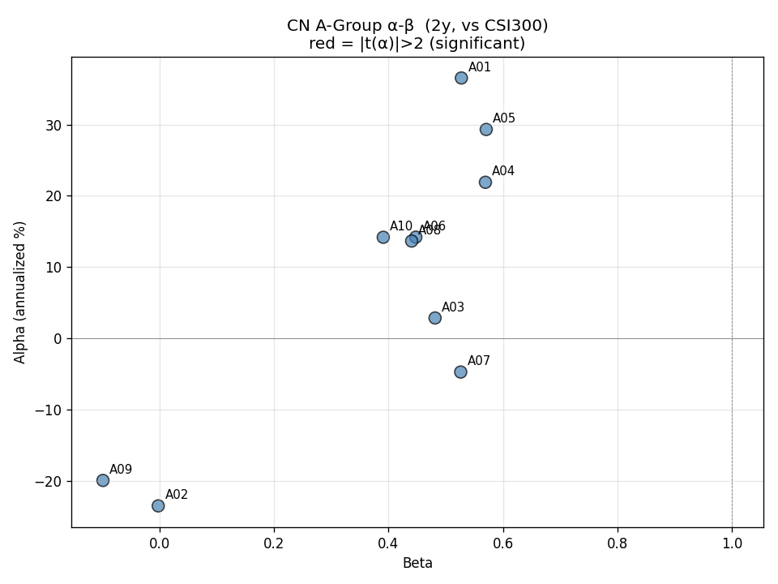
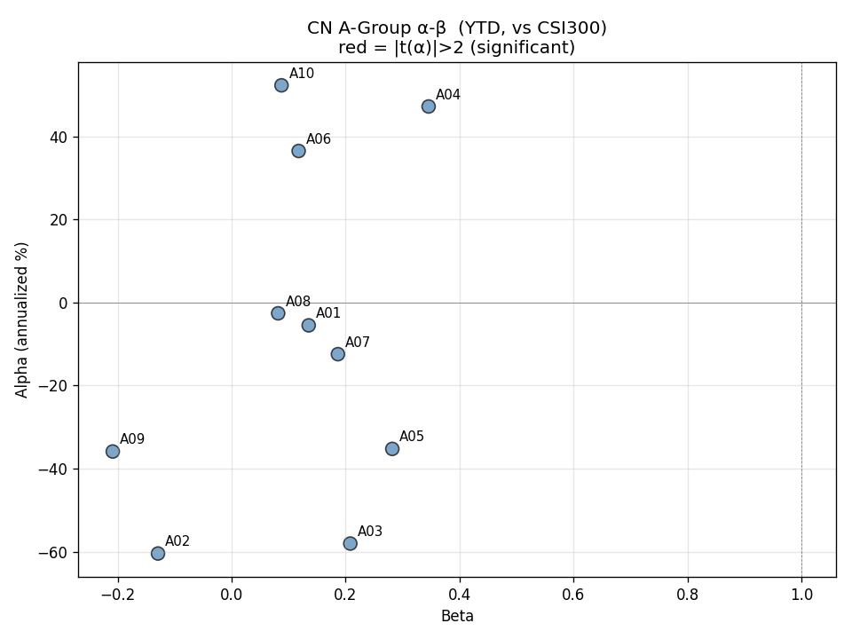
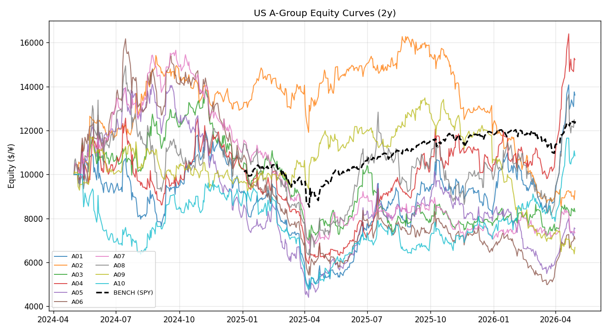
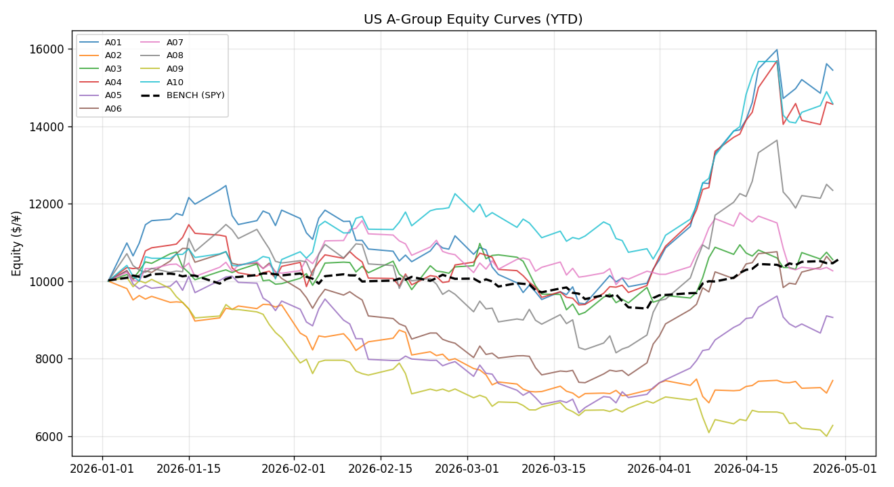
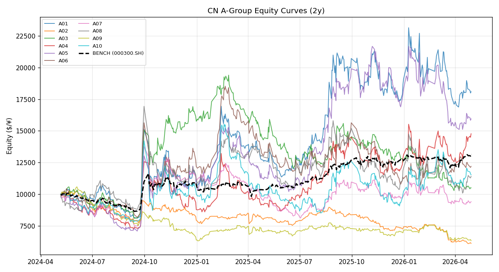
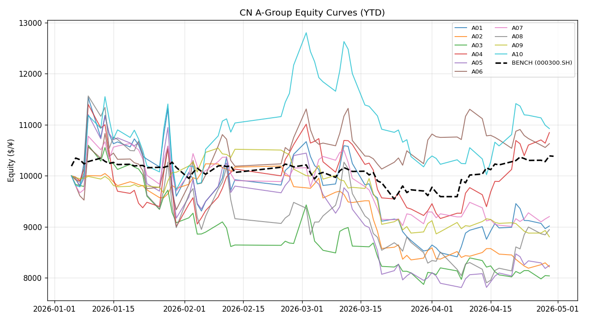

# α 还是 β？给 A 组 20 个策略账户做一次诚实的归因

> 探讨日期：2026-05-04  ·  作者：Cyber Quant Arena  ·  分类：Performance Attribution

## 1. 上一篇文章留下的疑问

[上一篇文章](./factor-composite-normalization)我们发现：A 组用 V1 合成方法在 2026 YTD 跑出年化 37%、夏普 2.13 的成绩。然后我们说"这其实主要是风格 beta 不是 alpha"——但那只是 V1 vs V2 的对比给出的间接推断。

这一篇我们用**多因子归因模型**直接给每个账户分解：
- 它的收益里多少来自**搭大盘便车**（CAPM β）
- 多少来自**小盘风格暴露**（SMB β）
- 多少来自**动量风格暴露**（MOM β）
- 扣掉这些之后，**还剩多少 α**（真正的选股能力）
- 这个 α **在统计上显著吗**（t-stat > 2）

跑 4 个面板：US/CN × 2y/YTD，每个面板 10 个 A 组账户。

> ⚠️ Q 组（Qlib 模型）跳过了——它需要 walk-forward 滚动重训，单机成本 40+ 小时。B 组（GP）也暂缓，等下一篇专题处理。本文只看 A 组（确定性公式可零成本重放 2 年）。

---

## 2. 方法论

### 2.1 离线重放
每个 A 组策略（A01–A10）的合成逻辑由 `factors/signal.py` 的 V1 实现 + `accounts/strategies.py` 的 `factor_names` / `top_n` / `strategy_type` 决定，**全是确定性公式**。直接在 2 年价格数据上重放即可获得每日权益曲线，无 look-ahead bias。

### 2.2 归因模型

**CAPM 单因子**：
$$r_a = \alpha + \beta \cdot r_{mkt} + \varepsilon$$

**Fama-French 三因子（简化版）**：
$$r_a = \alpha + \beta_{mkt} r_{mkt} + \beta_{smb} r_{smb} + \beta_{mom} r_{mom} + \varepsilon$$

其中：
- US：r_mkt = SPY，CN：r_mkt = 沪深300（000300.SH）
- r_smb = 流动性最低 30% 票 - 流动性最高 30% 票（用日均成交额作市值代理）
- r_mom = 过去 12 个月动量 top 30% - bottom 30%

### 2.3 显著性判断
**|t-stat| > 2 才认为该参数显著非零**。这是统计学的基本门槛。t < 2 意味着我们没有足够证据说"这个 α 不是 0"，无论它的点估计看起来多大。

---

## 3. CAPM 结果（4 矩阵）

### 3.1 散点图（α 纵轴年化 %，β 横轴）

红点 = |t(α)|>2 显著；蓝点 = 不显著。

**US 2 年**：

**US YTD**：

**CN 2 年**：

**CN YTD**：

### 3.2 关键观察

#### 观察 1：所有 α 在 CAPM 下都不显著
4 个矩阵 × 10 账户 = 40 次回归，**0 个 |t(α)| > 2**。最高的 US YTD A09 也只到 -1.94（且 α 是负的）。这意味着**没有任何账户能在 CAPM 维度上证明自己有 alpha**。

US YTD 看起来漂亮的 A01（α=147%/年）、A04（α=117%/年）、A10（α=127%/年）—— t(α) 全都在 1.5–1.7 之间，**勉强算趋势但远不够显著**。

#### 观察 2：β 普遍很小（|β| < 0.7）
A 组账户**和大盘的相关性极低**，R² 普遍 < 0.07。这是因为每天只持 3–8 只票，组合高度集中，被某只票的特异波动主导。这个发现本身没好坏——它意味着这些账户**不是简单的"市场指数 + 杠杆"**。

#### 观察 3：CN 账户 β 系统性高于 US
CN 2y 平均 β ≈ 0.4；US 2y 平均 β ≈ -0.13。CN 账户更紧跟沪深300，US 账户和 SPY 几乎独立。原因可能是 CN 票池只有 300 只，A 组每天选 5 只，**和指数成分重叠率高**；US 池子有 1000 只，重叠率低。

#### 观察 4：US 2 年 β 是负的，YTD 翻成正的
看 US A03、A05、A07 这几个——2y β = -0.31、-0.32、-0.24，**反向跟大盘**。但 YTD 它们的 β 翻成正的。这说明这套策略在不同市场环境下有 regime shift，**长期 β 平均下来接近 0 不是因为它"市场中性"，而是因为 β 本身在波动**。

---

## 4. FF3 结果（叠加 SMB + MOM）

### 4.1 关键统计（仅列出 |t|>1.5 的项）

完整表见 `summary_ff3.csv`（已附在文末）。摘要：

**US YTD —— SMB 暴露非常显著**：

| 账户 | t(α) | t(SMB) | t(MOM) | R² | 解读 |
|---|---|---|---|---|---|
| A01 | 1.36 | **2.22** | 0.44 | 0.10 | 收益主要来自小盘暴露 |
| A04 | 1.50 | **2.82** | -0.40 | 0.15 | 收益主要来自小盘暴露 |
| A05 | 0.21 | **2.47** | -1.42 | 0.12 | 完全是小盘 beta |
| A07 | -0.29 | **2.02** | 1.34 | 0.06 | α 已被解释为风格 |
| A06 | 0.17 | 1.00 | -0.01 | 0.08 | 显著市场 β=0.79 |

**这是关键证据**：上一篇文章的猜测——"A 组 YTD 业绩主要来自风格 beta"——**在 FF3 模型里被直接证实**。A04 的 SMB β=1.69, t=2.82 意味着它每天的收益约 1.69 倍地复制小盘组合的收益。

**CN 唯一显著项**：
- CN A03 YTD: t(MOM) = **2.16**，α 显著负（t=-1.81）。账户被动量风格反向拖累，是个负贡献。
- CN A09 2y: t(SMB) = -2.03, t(MOM) = -2.17。"反向"暴露在 SMB 和 MOM 上。

### 4.2 加了 SMB+MOM 后还有 α 吗？

**没有**。40 次 FF3 回归里，**没有一个 |t(α)| > 2**。

最高的几个 t(α)：
- US A04 2y: t(α)=1.95（边缘）
- US A01 2y: t(α)=1.84
- US A10 2y: t(α)=1.89
- US A10 YTD: t(α)=1.78

这些都是"看起来有趋势，但统计上不能拒绝 α=0 的零假设"。

---

## 5. 净权益曲线对照

每个面板叠加全部 10 个 A 组账户和市场基准：

**US 2 年**（vs SPY 黑虚线）：

**US YTD**（vs SPY）：

**CN 2 年**（vs 沪深300）：

**CN YTD**（vs 沪深300）：

视觉印象：
- US 2 年：分散度极高，A 组各账户曲线相互穿插，没有明显跑赢/跑输 SPY。
- US YTD：多个账户跑赢 SPY，但 A09 大幅跑输，整体看起来是"运气"而不是"能力"。
- CN：账户曲线总体沿沪深300 的方向走，分散度比 US 小（β 更高的体现）。

---

## 6. 结论：到底哪些账户有真 alpha？

**没有。一个都没有。**

40 次 CAPM 回归 + 40 次 FF3 回归，**80 次中没有一次 |t(α)| > 2**。

这不是说 A 组在亏钱（部分账户绝对收益不错），而是说：

> **它们赚的钱无法在统计上被证明是来自选股能力，而不是来自 (a) 偶然性 (b) 风格暴露 (c) 两者结合。**

这正是上一篇文章 V2 实验给出的同一结论的**直接验证**：在剥离了市值/行业/动量风格之后，A 组的 IC 接近零，对应到这里就是 α 不显著。

---

## 7. 为什么 t-stat 这么难达到 2

A 组账户每日波动率（年化）大概在 30–55% 之间。要让一个 α=15%/年 的真信号在 t > 2 下显著，需要的样本量大约是：

$$n \gtrsim \left(\frac{2 \cdot \sigma_{annual}}{\alpha_{annual}}\right)^2 \times 252 \approx 1700 \text{ days} \approx 7 \text{ years}$$

**我们只有 2 年（330–482 天）和 4 个月（76–81 天）的样本**。即使 A 组真的有 15% 的 alpha，也要再跑 5 年才能在统计上证明。

这是个值得记住的常识：**"alpha 是不是真的"和"多久能证明它是真的"是两个独立的问题**。后者由 alpha 的大小、波动率、样本量共同决定。在小账户、短周期、高波动场景下，**绝大多数看起来的 alpha 都不能在 95% 置信度下显著**。

---

## 8. 那我们该怎么办？

### 8.1 不要根据 4 个月业绩做战略决策
US YTD 那几个账户（A01/A04/A10）累计收益看起来漂亮，但 t(α) 全部 < 2。它们的 SMB β 高，意味着**一旦小盘风格反转**，业绩会迅速回吐。这种 paper P&L 不应该被解读为"策略好"。

### 8.2 用 FF3 持续监控每个账户的暴露
暴露本身不是坏事——很多对冲基金故意暴露在某些风格上赚 risk premium。但**你要知道自己在赚什么**。如果一个账户标榜自己是"动量策略"但 FF3 显示它的 t(MOM) 只有 0.5、t(SMB) 高达 2.5，那这账户的实际身份是"小盘策略"，不是"动量策略"，止损/风控/资金分配的逻辑都得改。

### 8.3 对 B 组（GP）有现实的预期
下一篇文章我们会用同样的归因 pipeline 跑 B 组。基于这一篇的结论：**短期看起来好的账户，几乎肯定不能在统计上证明 alpha**。这不是 GP 算法的失败，而是物理学定律——样本量不够。

### 8.4 真正能改善的方向
- **延长样本期**：等数据慢慢攒，至少需要 5+ 年才有可能看到显著 α。
- **降低账户波动率**：通过仓位控制把波动率从 50%/年压到 15%/年，理论上 t-stat 提升 3 倍多。这就是为什么对冲基金普遍把波动率限制在很低水平。
- **多账户合并**：把 A 组 10 个账户的收益等权合并成"A-Composite"，分散化降波，t-stat 更容易显著。下篇文章可以补这个分析。
- **找真正不相关的 alpha**：而不是继续在同一个因子库（Alpha158）的不同子集上试不同的合成方法。

---

## 9. 一句话总结

**给 20 个策略账户做了一次完整的多因子归因，结果是 0 个有统计显著的 alpha。** 看起来漂亮的 YTD 业绩主要来自小盘风格暴露（FF3 SMB β 显著），是搭便车不是真本事。这不丢人——这是行业常态。但承认它，比假装自己有 alpha 更有价值。

---

## 10. 复现

代码：`research/agroup_attribution.py`（330 行，含 SMB/MOM 因子构造）
依赖：`data/trading.db` 的 1d 价格 + `config/settings.py` 的 US/CN universe
运行：`source venv/bin/activate && python research/agroup_attribution.py` —— 2-3 分钟跑完全部 4 矩阵。
原始数据：[summary_capm.csv](summary_capm.csv) · [summary_ff3.csv](summary_ff3.csv)
