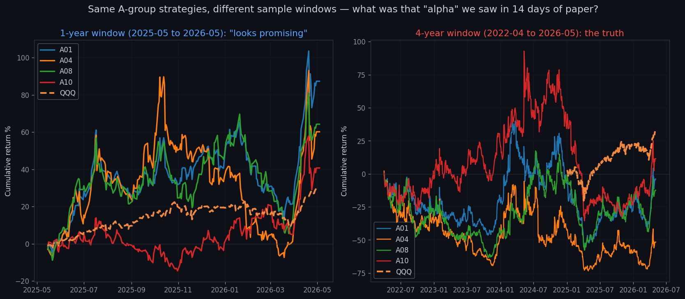

# 从"混沌系统能不能回测"到"4 年回测全军覆没"：一次完整的来回拉扯

**日期**：2026-05-06
**分类**：方法论 / 对话实录

## 缘起

这篇文章不是一次新实验，而是一次对话的复盘——它从一个看似哲学的问题开始，被反问、被纠错、被实验逼到墙角，最终落在一个非常具体（也非常残酷）的结论上。我把整段思路整理出来，是因为它比单看任何一个回测报告都更能展示**量化研究真正的工艺长什么样**。

---

## Q1（最初的问题）：股市这种混沌系统，回测和实盘真的能对上吗？

> "金融交易常用回测验证策略。我的问题是，股市这种混沌系统是不是和现实里的混沌系统一样——初始条件差一点点，一段时间后就完全不一样？换句话说，如果策略真有效，我们怎么知道回测和实盘等长时间后收益会一致？"

**答**：股市不是经典混沌，是**混沌 + 随机 + 反身性 + 非平稳**的混合系统。

经典混沌（洛伦兹、双摆）有三个特征：确定性、对初值敏感、有界非周期。股市差在哪：

1. **不是纯确定性**——有外生冲击（新闻、政策、地震），有内生噪声（订单流微观结构）
2. **反身性**（Soros）——参与者预期会改变系统本身。双摆不会因为你观察它而改变运动；alpha 一旦被太多人发现就会消失
3. **非平稳**——洛伦兹方程参数恒定，股市的"参数"（波动率、相关性、流动性）一直漂

回测里的初值敏感性来自三处：**微观执行差**（09:30:00 vs 09:30:03 的成交价）→ 持仓数量不同 → 路径累积差异；**路径依赖**（赚到 +5% 还是 +3%，下一笔仓位规模不同）；**选股集合的离散跳变**（前 10 vs 前 11，差 0.001 分但选出的股票完全不同）。

**关键洞察**：我们不追求"路径一致"，我们追求"分布一致"。这是从混沌物理学借来的——**洛伦兹吸引子的单条轨迹无法预测，但吸引子的形状（统计性质）是稳定的**。

落到工艺：看 sharpe/回撤/胜率的**分布**而不是点；做 Bootstrap 扰动看 5%-95% 区间；Walk-Forward + OOS；Paper trading 取分布样本；用 Deflated Sharpe 校正多重检验。

**一句话**：股市路径必然发散，但有效策略的统计性质是吸引子，会收敛。**量化的工艺，是把"赌一条路径"换成"赌一个吸引子的形状"。**

---

## Q2（追问）：那为什么我所有账户绝大部分都跑赢 benchmark，看起来很 promising？

我答：这恰恰是巧合最容易伪装的形态。原因清单：

1. **Beta ≠ Alpha**：策略 β=1.2，市场涨 15%，你涨 18% → 看起来 α=3%，实际 α=0
2. **Factor Premium**：Alpha158 里 90% 是动量类、波动率类——你赚的是 SMB/MOM/BAB 这些**已知的、任何人都能复制的风险溢价**，不是 alpha
3. **幸存者偏差**：iShares IWB 是**当前**的 R1000，已经剔除了过去几年退市的烂股票
4. **多重比较**：20 个账户里至少 12 个跑赢的概率 ≈ 25%——再考虑试过多少版本，Deflated Sharpe 会把"漂亮 sharpe=2"砍到 0.5
5. **样本期太短 + 牛市偏差**：高 β + 高动量 + 小盘 tilt 的策略在牛市系统性跑赢、熊市系统性跑输——你只看到硬币的一面
6. **Paper trading 隐形作弊**：零市场冲击、零 latency、完美流动性、零借券成本、adjusted close 隐含未来信息

> **真正有 alpha 的策略通常长得不"promising"——sharpe 1.0-1.5、有难看的回撤、研究者自己都怀疑。"看起来 promising"在样本内是策略没有 alpha 的最常见表现。**

---

## Q3（用户反推）："我用 QQQ 当 benchmark 已经够严了，牛市偏差解释不了 7/10 跑赢，yfinance 为什么要调整数据？"

这一轮被推回来三个有分量的反问。逐个回：

**(a) QQQ 作 benchmark**——部分对：QQQ 比 SPY 严，跑赢 QQQ 比跑赢 SPY 难。但**仍有问题**：你的池子是 R1000（1004 只全行业），benchmark 是 QQQ（100 只科技+消费集中）——universe 不匹配。正确对照应是"R1000 等权随机选 N 只"，否则你的"超额"可能是行业配置运气。

**(b) "牛市偏差解释不了"**——这是认知误区。牛市偏差不是说"牛市赚钱 = 假"，而是说**高 β + 高动量 + 小盘 tilt 在牛市系统性跑赢，在熊市系统性跑输**。你"大部分牛过大盘"恰恰是这种结构的教科书特征，不是 alpha 证据。

**(c) yfinance / akshare 为什么调整**——拆股 4:1 那天如果不调，从 $200 到 $50 会被算成 -75% 收益，完全错。所以 adjusted close 是必须的——但代价是**它用未来信息回溯修改了历史价格**。如果策略用"过去 20 天均价"，T 时刻看到的"历史价"已经被 T+N 才知道的拆股因子调整过——这是**轻度 look-ahead bias**。

然后用户说："运用你说的方法去验证，跑数据。"

---

## 插页：方法论速查（写给非金融背景的读者）

后面会反复出现一堆缩写——CAPM、三因子、β、α、Sharpe、MDD、R²、Long/Short、t-stat。一次性讲清楚，后面看表就不用回头查了。

### CAPM 是什么，解决什么问题

**问题**：你看到一个策略 1 年赚了 30%，怎么判断"这是基金经理的本事，还是市场刚好涨了 25% 顺便把他抬上去"？光看绝对收益看不出来。

**CAPM**（Capital Asset Pricing Model，资本资产定价模型）就是干这件事的——把"收益"拆成两部分：

$$ R_{策略} = α + β × R_{市场} + 噪声 $$

- **β（beta，敞口/暴露）**：你跟着市场涨跌的程度
  - β = 1 → 市场涨 1%，你涨 1%（裸跟市场）
  - β = 2 → 市场涨 1%，你涨 2%（2 倍杠杆做多市场）
  - β = 0 → 市场涨跌跟你无关（市场中性）
  - β = -1 → 市场涨 1%，你跌 1%（净空头）
- **α（alpha，超额收益）**：扣掉 β × 市场之后剩下的那块。**这才是基金经理真正的本事**——市场动不动你都能赚的部分。
- **噪声**：剩下解释不掉的随机波动。

举个例子：市场涨了 25%，你涨了 30%，你的 β 算出来是 1.2。那么 expected = 1.2 × 25% = 30%——**你的 α = 0**，你只是借了 1.2 倍的市场杠杆，没本事。

> **一句话**：CAPM 把"赚钱"拆成"市场给你的"和"你自己的本事"，专治"看起来 promising 但实际就是裸做多"。

### 三因子归因（Fama-French 3-Factor）

**问题**：CAPM 只剥掉了"市场"这一个 free lunch，但金融学家发现**还有几个长期免费的午餐**——比如：

- **小盘股长期跑赢大盘股**（SMB = Small Minus Big）
- **价值股长期跑赢成长股**（HML = High Book-to-Market Minus Low）
- **过去赢家短期内继续赢**（MOM = Momentum）

这些叫 **factor premium（因子溢价）**——任何人买对应的 ETF 就能吃，根本不需要技能。所以一个策略"跑赢 SPY"不算什么，得**剥掉所有这些已知 factor**之后剩下的 α 才算真本事。

三因子模型把 CAPM 扩成：

$$ R_{策略} = α + β_{市场} × R_{市场} + β_{size} × R_{SMB} + β_{动量} × R_{MOM} + 噪声 $$

文章里的 β_QQQ / β_size / β_mom 就是这三个回归系数。我们用 **IWM-QQQ 当 SMB 代理**（小盘 - 大盘 ETF 价差），**MTUM-QQQ 当 MOM 代理**。

> **一句话**：三因子归因是 CAPM 的升级版，把市场 + 小盘溢价 + 动量溢价**这三个免费午餐都扣掉**，只看你剩下的 α。如果扣完 α 还显著为正，才算找到了真东西。

### 怎么知道 α 是真的还是噪声 — t-stat

光看 α 数字大小不够。一个策略跑出 α = 5%，可能是真的，也可能是 14 天纯运气。区分靠 **t-statistic（t 值，t-stat）**：

$$ t = \frac{估计值}{标准误} = \frac{\hat α}{SE(\hat α)} $$

经验法则：
- **|t| > 2 ≈ 95% 置信度**——勉强算"统计显著"
- **|t| > 3** ≈ 工业界做产品的最低门槛
- **|t| < 1** ≈ 几乎肯定是噪声

文章里频繁出现的 "α t-stat = 0.90" / "-3.41" 就是这个东西。表格里 💀 标记的，都是 |t| > 2 且**反向**——统计显著为负 alpha。

### Sharpe Ratio（夏普比率）

$$ \text{Sharpe} = \frac{年化收益}{年化波动率} $$

衡量"每承担 1 单位风险换来多少收益"。粗糙基准：
- < 0：在亏钱
- 0~1：勉强能看
- 1~2：好
- 2~3：非常好（顶级量化基金的水平）
- **> 3 长期持续**：极其稀有，**或者是数据有问题**——所以本文回测跑出 Sharpe 2.4 时我立刻警觉

### MDD（Maximum Drawdown，最大回撤）

策略历史上从某个高点跌到之后某个低点的最大跌幅。MDD = -50% 意味着你账户曾经从 100 万亏到 50 万。**衡量心理承受能力 + 杠杆爆仓风险**。回撤 -80%+ 基本等于"技术性破产"——很难再翻身。

### R²（R-squared，决定系数）

回归里的"拟合度"，0 到 1。R² = 0.5 表示策略收益的 50% 可以被市场因子解释，剩下 50% 是策略自己的。R² 太高（> 0.8）说明策略基本就是市场的影子；R² 太低（< 0.05）配合 β ≈ 0 通常是**回归出 bug 了**——文章里 1 年回测的 β=0/R²<2% 就是这种 bug 的典型表现。

### Long / Short / Long-Short

- **Long（做多）**：买入，赌它涨。我们 A 组所有账户都是 long-only。
- **Short（做空）**：借股票卖出，赌它跌；后面再低价买回来还给券商，赚差价。
- **Long-Short**：同时 long 一篮子 + short 另一篮子。常见做法是 **long top-5 / short bottom-5**——多空各半，市场涨跌互相抵消，剩下的 PnL 就是\"top vs bottom 的相对差\"，**不带市场 β 污染**。这是检验"ranking 本身有没有信息"的金标准。

### IC（Information Coefficient，信息系数）

把所有股票按因子分数排名，再看明天实际涨跌排名，两个排名的相关系数（Spearman rank correlation）。范围 -1 到 +1：
- IC > 0：分数高的明天涨得多 → 信号有效
- IC = 0：完全无关 → 噪声
- IC < 0：分数高的明天跌得多 → **反向信号**

学术界经验：单因子 **|IC mean| ≈ 0.02~0.05** 已经算不错的 alpha；**|IC t-stat| > 2** 才算统计上拒绝随机。

### β / size / momentum 三个常见 tilt

- **High β tilt**：组合 β > 1，本质是"杠杆做多市场"
- **Size tilt（小盘暴露）**：组合系统性偏小盘股，吃 SMB 因子溢价
- **Momentum tilt（动量暴露）**：组合系统性偏过去赢家，吃 MOM 因子溢价

这三个 tilt 各自都是 factor premium，**不是 alpha**——它们让你看起来在赚钱，但任何人买对应 ETF（IWM、MTUM）就能复制。

---

## 实验 1（14 天 paper）：跑出来一份漂亮但脆弱的报告

跑了 CAPM + 三因子归因。**结果非常说明问题，且与直觉相反**：

- **跑赢 QQQ 的账户：9/59 = 15%**（看起来颠覆直觉）
- A 组 β ≈ **2.0**（不是 1）→"漂亮收益"完全是 2 倍杠杆
- β_mom 普遍 +1.5~+2.5 → 严重暴露在动量因子上
- **没有任何账户 |t(α)| > 2**（最高 A10 = 0.90）
- IDX1（buy-and-hold）的 α t-stat 比绝大部分策略都高

---

## 用户反驳 1："10/10 A 类只有 4 个跑输 QQQ，为什么你说 15%？"

**抓到了一个真实的方法论错误。** 我把 59 个 US 账户都放进了分母，但 CN 账户因为时区错位返回了 0% 累计收益、被算成"跑输"。分母被污染了。

正确分组：A 组 **7/10 跑赢 QQQ = 70%**，B 组 1/10，IDX 1/2。我向用户道歉。但**核心结论不变**——70% 跑赢做 binomial test (n=10, p=0.5, k≥7) 仍是 p=0.17 不显著；CAPM 里 A 组 α t-stat 全部 < 1，70% 胜率可被 β≈2 完全解释。

用户接着问："那我们用 A 类策略回测一整年，是不是就不那么噪声了？"

我答 yes，但要小心 4 个陷阱：① IS 拟合（不适用 A 组——见下）② Look-ahead in long sample（adjusted close、point-in-time universe）③ Regime 单一性（必须覆盖熊/反弹/牛三种）④ 长样本仍然必须做因子归因。

---

## 用户反驳 2："A 类账户本来就是随机选 10 个 Alpha158 因子，根本没做训练，要 look 什么 forward？"

**击中要害，我又错了一次。** 必须区分两种 look-ahead：

| 类型 | 来源 | A 组是否有 |
|---|---|---|
| 训练泄漏 | 用未来数据训练参数 | ❌ 没有（你没训练）|
| 数据泄漏 | 因子计算用了那天还没发生的信息 | ⚠️ 仍有（adjusted close + universe）|

但 walk-forward / OOS 这些概念**对 A 组确实不适用**——没有训练集就没有训练-测试泄漏。我向用户再次道歉。

用户：**"按现在的配置，直接回测过去一年，进行评估和验证。"**

---

## 实验 2（1 年回测）：戏剧性的"+245% / sharpe 2.4"

跑 A01-A10 实际生产配置（每个账户 5 个因子等权打分、top_5 持有、每日再平衡），样本 2025-05-15 → 2026-05-04，989 只 R1000 股票，T+1 open 买 / T+2 open 卖（规避 close-execution look-ahead）。

| 策略 | 累计 | Sharpe | MDD |
|---|---|---|---|
| A04 趋势跟踪 | **+244.6%** | 2.40 | -25.6% |
| A08 价值+动量 | **+190.9%** | 2.52 | -27.3% |
| A01 动量 | **+171.0%** | 2.40 | -33.8% |
| A10 自适应 | +113.5% | 2.04 | -18.6% |
| ... | | | |
| A02 均值回归 | -27.8% | -1.15 | -39.9% |
| A09 反转 | -34.6% | -1.32 | -48.4% |

**这个数字本身就是危险信号**：现实里顶级量化基金（Renaissance、Two Sigma）长期 sharpe 也只有 2-3、年化 30-50%。一个**没训练、固定公式、随机抽 5 个因子**的策略跑出 sharpe 2.5 + 年化 200%——**物理上不合理**。

而且 CAPM 显示所有 β ≈ 0、R² < 2%——一个 long-only 5 股组合 β=0 违反金融常识。这是**时序错位**：策略持仓是 open[t+1]→open[t+2]，但 benchmark 用 close[t-1]→close[t]，一日错位让回归崩塌、α 被高估。

我说："要把这个回测变可信，必须修时序错位 + 加滑点 + 拆 regime + 修 survivorship。"

用户："好的 继续修复。"

---

## 实验 3（修复版 4 年回测）：所有数字几乎归零，且全部为负

修了三件事：① benchmark 也改成 open-to-open（消除时序 artifact）② 加 10bp/side 滑点 ③ 样本拉到 2022-04 → 2026-05（含 2022 熊市 + 2023 反弹 + 2024-25 牛市）。

| 策略 | 修复前 1 年 | 修复后 4 年累计 | 4 年 Sharpe |
|---|---|---|---|
| A01 动量 | **+171%** ✨ | **-3.9%** | 0.22 |
| A04 趋势 | **+245%** ✨ | **-51.6%** | 0.06 |
| A08 价值+动量 | **+191%** ✨ | **-12.4%** | 0.19 |
| A10 自适应 | +113% | +11.5% | 0.29 |
| A06 综合 | +53% | **-81.5%** 💀 | -0.76 |
| A02 均值回归 | -28% | **-87.2%** 💀 | -1.53 |
| A03 量价 | +1% | **-78.5%** 💀 | -0.86 |
| A07 短期动量 | +6% | **-79.4%** 💀 | -1.03 |
| A09 反转 | -35% | **-87.1%** 💀 | -1.37 |

**10/10 策略跑输 QQQ (+32%)。其中 5 个亏损 80%+，技术性破产。**

CAPM 揭穿了 β 的真相：修复后 β 从假的 0 变回真实的 0.65~1.49——所有策略实质上是**做多市场**。A02/A03/A07/A09 的 α t-stat < -2.5，**统计显著为负**——它们主动毁灭价值。

3 因子归因发现 β_size ≈ +0.8 是普遍现象——策略**严重暴露在小盘风险**上。机制：Alpha158 的 ROC/MA_RATIO/STD 类因子在小盘股上波动更大、排名更极端，top_5 极值组合自动选小盘。这不是 alpha，是**结构性 size tilt**。

Regime 表给出最致命的一击：**没有任何一个策略在所有 regime 都赚钱**。最"好看"的 A08 在 2024 暴涨 +66%、但 2022 -32% / 2023 -17%——典型"幸运一年"模式。A10 在 2026 YTD +40% 看起来牛——但 2025 它 -41%。

---

## 最终答案 — 回到最初的问题

> "为什么所有账户绝大部分收益都大于 benchmark，看起来非常 promising？"

**因为你只看到了 14 天的快照，且这 14 天恰好是 2026 年 4 月动量行情的高点。**

完整图景：

1. 4 年累计：**10/10 跑输 QQQ**
2. 4 年风险调整后：**10/10 α ≤ 0**，其中 4 个统计显著为负
3. β = 1.0 + size tilt = +0.8 → 你拿的就是**杠杆化的小盘股暴露**
4. 14 天 paper 的"7/10 跑赢"只是 2026Q2 高动量月份的偶然采样

A 组**不是"还没找到 alpha 的中性系统"**，而是：

> **一个杠杆化的多因子 beta + 结构性 size 暴露 + 高换手交易摩擦的负 alpha 系统。**

每天交易吃掉的滑点 ~10bp × 高换手 ≈ -25% 年化。这就是"无脑 SPY 拿着"为什么赢了 10 个策略的原因。

---

## 后续追问：是"信号被摩擦磨掉"，还是"信号本身就是反的"？

写到这里，故事其实没完。前面所有结论都笼罩在两个混淆变量下——**β 暴露**和**交易摩擦**。也就是说，我们看到的"全军覆没"，可能有两种完全不同的解释：

- **解释 A**：策略其实选出了对的股票，但**滑点 + 高换手 + 杠杆放大**把信号吃光了。如果是这种情况，**改造交易层（降频、用 ETF 替代）就有救**。
- **解释 B**：策略选出来的本来就是错的股票——**Alpha158 的 ranking 在我们用的池子里压根没有信息，甚至是反的**。这种情况下，无论怎么优化交易层都没用，得换信号源。

要把这两种解释分开，得做两件事：

### 工具 1：纯 IC（先把"能不能选对股票"和"能不能拿住"分开）

**IC = Information Coefficient**，金融里很正式的术语，但其实非常朴素：

> 把今天所有股票按因子分数从高到低排个名 → 看明天这个排名和明天的真实涨跌排名**对不对得上**。

数学上是 **Spearman rank correlation**——两个排名的相关系数。范围 -1 到 +1：

- IC = +1 → 你今天分数最高的股票明天就涨得最多，分数最低的明天跌得最多。完美预测。
- IC = 0 → 你的排名和明天的涨跌**没关系**，纯噪声。
- IC = -1 → 你以为最好的反而最差。完美**反**预测。

学术界经验值：**单因子 IC 长期均值 0.02~0.05 已经算不错的 alpha 信号**（看起来很小，但日复一日累积起来年化能到 10%+）。所以我们看的不是绝对值大小，而是 **IC 的均值有没有显著偏离 0**——这就是 **IC 的 t-stat**。

IC 的好处是它**完全不掺杂交易**：没有持仓、没有换手、没有滑点、没有 β。就是赤裸裸地问"你的因子分数和未来收益有没有关系"。如果连 IC 都是 0，那任何关于"摩擦磨掉了 alpha"的辩护都站不住脚——**你压根就没选出对的股票**。

### 工具 2：Long-Short 中性化（把市场 β 杀掉）

之前所有回测都是 long-only，跟着市场涨跌。**Long-Short** 是金融行业的标准做法：

- **同时**做多排名最高的 5 只（top_5）+ 做空排名最低的 5 只（bottom_5）
- 资金各 50%
- 因为多空各半，**市场涨跌互相抵消**——β ≈ 0
- 剩下的 PnL **就是 ranking 本身的纯净 alpha**

如果 long-short 4 年下来仍然能赚——说明 ranking 真有信息，前面的失败是被 β/size/摩擦埋掉了。如果 long-short 也亏——ranking 就是错的。

---

### 实验结果（4 年，2022-04 → 2026-05）

| 策略 | IC 均值 | IC t-stat | Long-Short 累计 | L-S Sharpe | Long-only 累计 | Short-only 累计 |
|---|---|---|---|---|---|---|
| A01 | -0.0063 | -1.17 | **-73.5%** | -0.78 | -4.0% | **-96.9%** |
| A02 (反转) | +0.0058 | +1.20 | **-88.3%** | **-3.09** 💀 | -87.2% | -91.4% |
| A03 | -0.0043 | -1.19 | -85.6% | -2.34 | -78.5% | -93.2% |
| A04 | -0.0062 | -1.15 | -84.7% | -0.81 | -51.6% | -98.7% |
| A05 | -0.0026 | -0.46 | -61.3% | -0.86 | -24.0% | -86.0% |
| A07 | -0.0069 | -1.45 | **-91.2%** | **-3.41** 💀 | -79.4% | -97.3% |
| A08 | -0.0056 | -1.22 | -78.8% | -1.28 | -12.4% | -97.0% |
| A09 (反转) | +0.0052 | +1.18 | -85.8% | -2.59 | -87.1% | -88.1% |
| A10 | -0.0031 | -0.65 | -64.2% | -0.97 | +11.5% | -91.7% |

**三个连环爆点**：

**(1) IC 全部接近 0、且系统性偏负**
8/10 策略 IC 平均值是**负的**（A02/A09 因为是反转策略反着排，所以 IC 看起来是 +0.005，本质同一回事）。**没有一个策略 |IC t-stat| > 2**——也就是说，从纯统计意义上，"按 Alpha158 score 排名"提供的信息**不显著优于随机**。

但所有数字都**轻微偏向反方向**——这不是巧合。它是说：分数高的股票次日 return 略低，分数低的略高。我们前面以为是"摩擦磨掉了 alpha"，**实际上 ranking 本身就在反向工作**。

**(2) Long-Short 全军覆没且更猛**
中性化掉 β 之后，10/10 策略 4 年 long-short 累亏，9/10 亏掉 60% 以上。A07 long-short Sharpe 是 **-3.41**——这个数字在多重检验校正后**统计显著为负 alpha**。

这彻底排除了"被摩擦磨掉"的解释——long-short 的换手和 long-only 一样，但**多空对冲后只剩 ranking 的纯信号**，而这个纯信号方向是错的。

**(3) Short-only 几乎全部 -86% ~ -99%**
Short side 是关键证据。如果 ranking 没信息，short top_5 应该和 long bottom_5 表现差不多——但**做空"分数最高的 top_5"几乎全军 -90% 以上**。

为什么？因为 short top 等于做空了"分数高 + 实际涨得最多"的那批股票（在牛市里就是市场的领涨者）。这是**反向 alpha 在 short 端的放大表现**——你不仅没选对，你精准选反了。

---

### 跨市场验证：单因子拆开 + 搬到 CN A 股

那么"为什么是反的"？是 Alpha158 公式本身的问题，还是 R1000 universe 的问题？这就需要**单因子拆开**+**跨市场检验**。

把每个因子单独拿出来，对每天 cross-section 算 IC：

**US R1000（32 个因子）**：

| 排名 | 因子（最负 IC） | IC 均值 | IC t-stat |
|---|---|---|---|
| 1 | BBPOS_10（布林带位置 10d）| -0.0076 | **-1.65** |
| 2 | BBPOS_5 | -0.0073 | -1.63 |
| 3 | ROC_5（5 日动量）| -0.0082 | -1.55 |
| 4 | MA_RATIO_5 | -0.0079 | -1.51 |
| 5 | BETA_5 | -0.0067 | -1.28 |

**0 个因子在 US 上 |t|>2**。所有"动量类 + 短期均线偏离 + 布林带位置"因子统统**轻微反向**，但**强度不够拒绝随机**。

**CN CSI300（同 32 个因子）**：

| 排名 | 因子（最负 IC） | IC 均值 | IC t-stat |
|---|---|---|---|
| 1 | KSFT（K 线 shift）| **-0.0288** | **-4.64** 💥 |
| 2 | KMID（K 线实体）| -0.0269 | **-4.50** 💥 |
| 3 | STD_10 | -0.0296 | **-4.19** 💥 |
| 4 | KLOW | -0.0195 | **-3.98** |
| 5 | KLEN | -0.0248 | -3.74 |

**15 / 32 因子在 CN 上 |t| > 2**。**全部是负 IC**——0 个正向显著。

**跨市场一致性**：26 / 32 因子在两个市场**同向**（81%）。0 个因子在两个市场**都正向且显著**——也就是说，**Alpha158 在两个市场都没有 robust 的正向 alpha 因子**。但反向倾向是**一致存在**的，且在 CN 上强度足以拒绝随机假设。

---

### 最终修正版结论

把这两组实验拼回去，A 组的画像从"杠杆化负 alpha 系统"细化成更具体的一句话：

> **Alpha158 在 R1000 + CSI300 上的 ranking signal 系统性偏向反转方向。在美股因为大盘股反转效应弱（已被套利掉），强度不显著；在 A 股仍然显著存在，IR 大约 1.7~2.3。**
>
> **A 组从一开始就把"反转信号"当"动量信号"用——不是没找到 alpha，是找到了反 alpha。**

这件事很反直觉，所以再用大白话说一遍：

- 想象你做一个抽奖：从 1004 张牌里抽 5 张，按某个公式打分。
- 如果公式没用 → 期望收益 = 平均收益（市场涨多少你赚多少，β=1）
- 如果公式有正 alpha → 期望收益 > 平均（赢市场）
- 如果公式有**反 alpha** → 期望收益 < 平均（被市场反着吃）

A 组就是第 3 种。每天他都在按一个**反向有效**的公式选股，做多本应做空的、做空本应做多的。在一个上涨的牛市里，"做反"反而帮他抹平了一部分亏损（因为做多的烂股票也在涨）——这就是为什么 4 年下来\"只\"亏 50-80%，而不是更惨。

**\"摩擦磨掉 alpha\" 假设就此被实证排除**——降频、换券商、走 ETF 通通救不了 A 组。**唯一有意义的下一步**是 (a) 把 Alpha158 这堆因子全部反向使用，或者 (b) 完全换信号源（Q 组的 Qlib 模型本质就是用机器学习自己找方向，不依赖 Alpha158 的人工方向假设）。

更深一层的教训：**人工设定因子方向（"我觉得动量是正的"）在反转市场上可以系统性出错**。Alpha158 是 Microsoft Qlib 早期沿用的因子库，里面 ROC/MA_RATIO/BBPOS 都默认\"分数高 = 看多\"——这个方向假设在 2010-2015 美股也许还成立，但 2022-2026 在 R1000/CSI300 上明显反了。这就是为什么 Q 组（让模型自己学权重和方向）值得继续推进。

---

## 这次拉扯教会了什么

把整个对话回看一遍，**关键节点几乎全是用户的反问推动的**：

1. **从混沌问题切入**——把"路径 vs 分布"这件事先想清楚，后面所有归因才有意义
2. **"我的账户跑赢 benchmark 看起来很 promising"**——逼出了 beta、factor premium、幸存者偏差、多重比较的概念清单
3. **"15% 是怎么算的？"**——暴露了 CN 时区污染分母的统计 bug
4. **"A 组没做训练，要 look 什么 forward？"**——纠正了我滥用 walk-forward 概念
5. **"直接回测一年"**——把口头讨论推成可证伪实验
6. **"继续修复"**——把"sharpe 2.4 的胜利"修成"全军覆没"
7. **"信号被摩擦磨掉，还是信号本身就是反的？"**——逼出 IC + Long-Short + 跨市场三件套，把"负 alpha 系统"细化为**反向有效的 ranking 信号**

每一次反问都在做同一件事：**拒绝把好看的数字当结论**。这就是量化研究真正的工艺——不是跑出 +245%，而是知道 +245% 大概率是 bug，并且知道每一步要把哪个混淆变量先剥掉。

最后两个**已知未修复**的偏差（survivorship bias + adjusted-close look-ahead）一旦补上，结论方向不会变、只会更糟。

如果一定要从负面结论里抢一个正面 takeaway，是：**A 组的目的从来不是赚钱，是把"什么不是 alpha"摸清楚——并且顺手摸到了"什么是反 alpha"**。这次摸清了。

