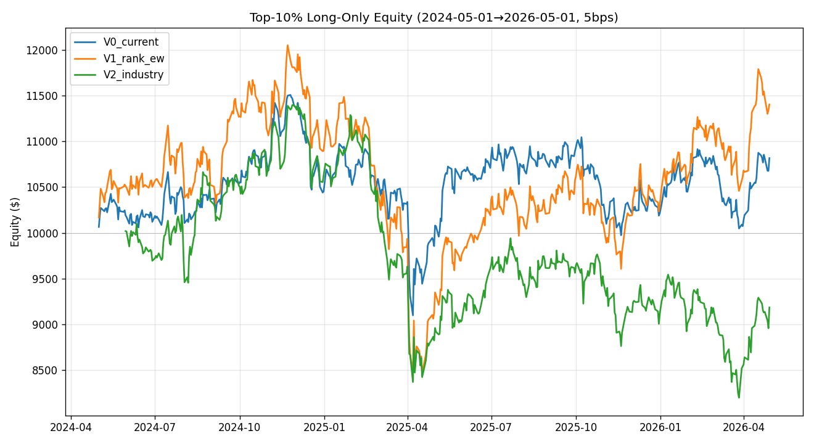
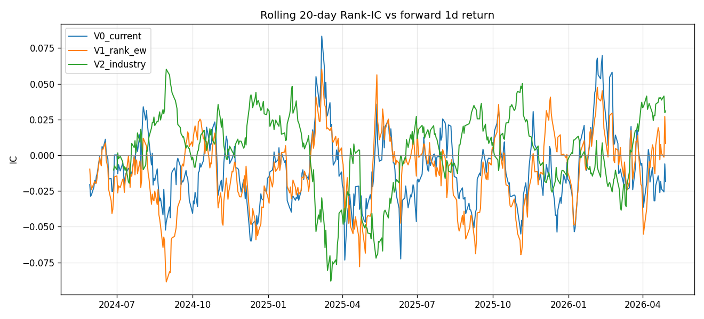
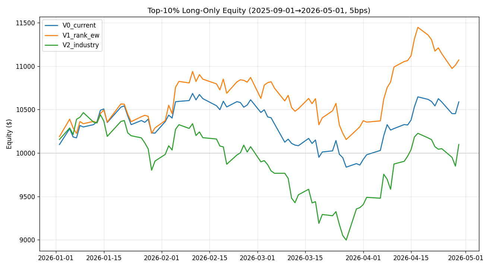
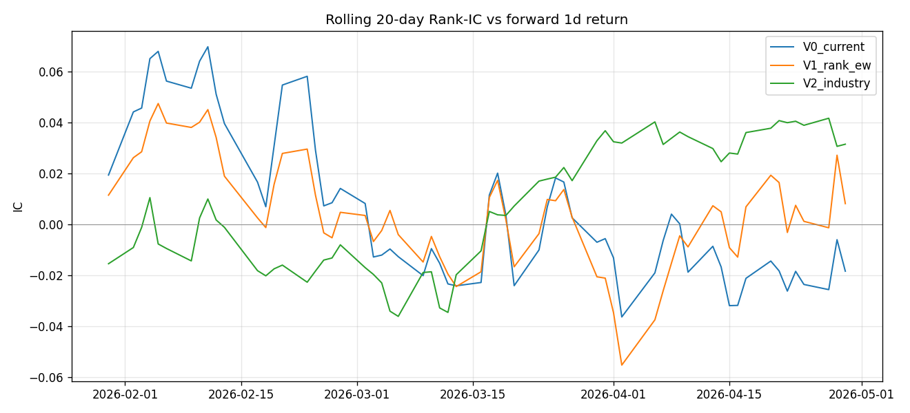
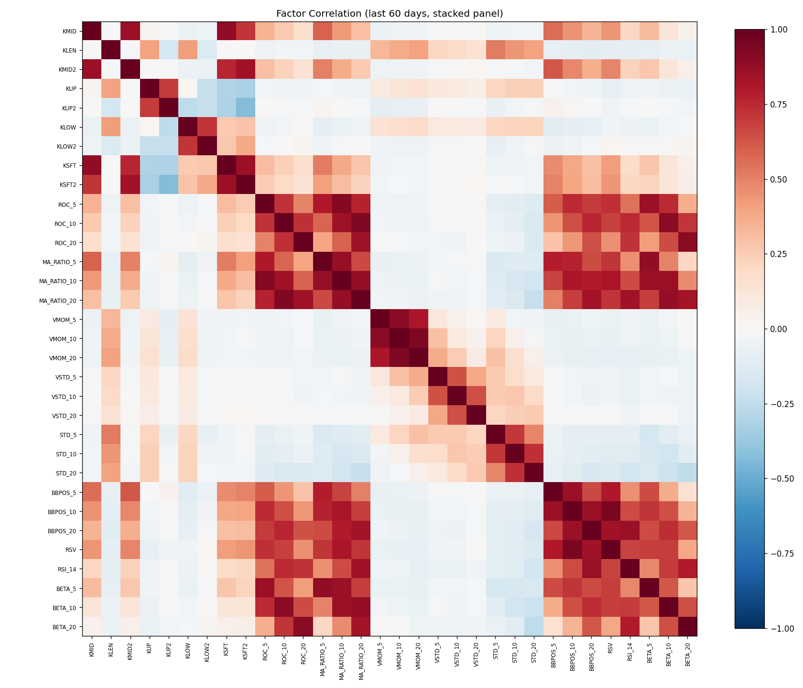

# Cross-Sectional Normalization in Multi-Factor Composites: A Bug, an Experiment, and an Honest Patch

> Date: 2026-05-04  ·  Author: Cyber Quant Arena  ·  Category: Alpha / Multi-Factor Combination

## 1. The Question

Our A-group accounts (A01–A10) use Alpha158-style multi-factor stock selection. Every day, for each Russell 1000 ticker, we compute ~30 factors (KMID, ROC_5/10/20, RSI_14, BBPOS_20, BETA_5...), combine them into a single score, sort, and buy the top 10.

The question: **these 30 factors live on wildly different scales — RSI_14 ∈ [0, 100], BETA_5 ∈ ±1e-5, ROC_5 ∈ ±0.01 — how do you "add them up" sensibly?**

This seemingly mundane engineering problem is called **factor combination / composite scoring**, and it's the most-overlooked step between "having a signal" and "actually placing trades".

---

## 2. The Status Quo

`factors/signal.py`, line 57:

```python
scores[ticker] = float(vals.mean())   # ← arithmetic mean across factors
```

Dead simple: **for each ticker, average its current values across ~30 factors**, then cross-section rank to pick top N.

> We'll call this **V0**.

### The hidden bug

Factor scale comparison:

| Factor | Typical magnitude |
|---|---|
| KMID, ROC_5 | ±0.01 |
| MA_RATIO_5 | ~1.0 |
| BBPOS_5 | ±2 |
| **RSI_14** | **0 ~ 100** ⚠️ |
| BETA_5 | ~1e-5 |

`mean(KMID, RSI_14, BETA_5, …)` is almost entirely determined by RSI_14 — it's orders of magnitude larger than everything else. In other words, **A01–A10's "composite" mode is effectively a disguised RSI_14 mean-reversion strategy**, with the other 29 factors as numerical noise.

Worse, the factor list contains heavy intra-family redundancy: `ROC_5/10/20`, `MA_RATIO_5/10/20`, `BBPOS_5/10/20`, `BETA_5/10/20` — measured pairwise correlations are ρ ≈ 0.65–0.80. This silently hands "momentum" 9 votes and "value" 0 votes.

---

## 3. The Proposed Fix

Simplest fix: **rank each factor cross-sectionally first (→ [0, 1]), then equal-weight average**.

```python
factor_ranks = cross_section_df.rank(axis=0, pct=True)  # per-factor cs rank
composite    = factor_ranks.mean(axis=1)                # equal-weight across factors
```

All factor scales collapse to [0, 1], every factor casts one vote, RSI_14 no longer dominates.

> Call this **V1**.

---

## 4. The Industry Standard

V1 fixes the scale issue but isn't industry-grade. The CITIC / Huatai / Barra-style sell-side / hedge-fund pipeline runs every day, **cross-sectionally**:

```
raw factor → MAD winsorize → fillna → neutralize → z-score → ICIR-weighted sum → rank
```

Key steps:

1. **MAD winsorize** (n=5): heavy-tail robust, beats 3σ.
2. **Neutralize**: cross-sectional regression on log(market cap) + GICS sector dummies, take **residuals**. Strips style beta, leaves "pure alpha".
3. **z-score**: keeps distance information (rank discards it).
4. **ICIR weight**: `w_i = mean(IC_i) / std(IC_i)` over a rolling 60-day window. Stable factors get heavy weight, noisy factors are auto-diluted.

> Call this **V2**.

---

## 5. Controlled Experiment: V0 vs V1 vs V2

`research/factor_composite_compare.py`: same Russell 1000 universe, same Alpha158 factor set, same backtest engine — only the composite method changes. Two windows:

### 5.1 Long window: 2024-05-01 → 2026-05-01 (2 years)

| Method | IC mean | ICIR | Ann. ret | Sharpe | Max DD | Decile spread |
|---|---|---|---|---|---|---|
| V0 (current) | -0.011 | -0.07 | 4.04% | 0.26 | -20.9% | -1.8 bps |
| V1 (rank+EW) | -0.012 | -0.09 | 6.84% | 0.35 | -29.7% | +0.2 bps |
| V2 (industry) | **+0.003** | **+0.029** | -4.36% | -0.23 | -28.0% | -1.9 bps |




**Counter-intuitive findings**:

1. **All three methods have IC ≈ 0**. Alpha158 — a 2014-vintage A-share price/volume factor library — barely has alpha on US R1000 over the past 2 years.
2. **V2 has the highest IC but the worst returns** — classic "cost of neutralization". V0/V1's 6% returns mostly came from un-neutralized market-cap / sector beta, not real alpha. V2 strips it away and the truth surfaces.
3. **V1 beats V0 on cumulative return but actually has slightly worse IC**. The gap is from tail-bet luck, not from a genuine improvement in the composite method.

### 5.2 Short window: 2026-01-01 → 2026-05-01 (4-month YTD)

| Method | IC mean | ICIR | Ann. ret | Sharpe | Max DD |
|---|---|---|---|---|---|
| V0 (current) | 0.0007 | 0.004 | 19.47% | 1.41 | -7.9% |
| **V1 (rank+EW)** | 0.0017 | 0.010 | **37.23%** | **2.13** | **-7.2%** |
| V2 (industry) | **0.0096** | **0.094** | 3.08% | 0.16 | -14.0% |




**The picture flips**:

- **V1's Sharpe 2.13 looks great** — but ICIR is just 0.01, statistically indistinguishable from noise. The flashy P&L mostly comes from being long the right "small-cap + sector X" style beta.
- **V2's ICIR jumps from 0.029 (2y) to 0.094 (YTD)** — 3× improvement. ICIR weighting needs IC sign stability to work; the long window's frequent IC sign flips were jamming the weights.
- **The ~34% annualized gap between V1 and V2 ≈ pure style beta exposure**. In the YTD style regime it pays; when style regimes flip, V1 will give it all back.

### 5.3 Factor correlation diagnostic



Average within-group |ρ|:

- `MA_RATIO_5/10/20` → **0.80** ⚠️
- `BBPOS_5/10/20` → **0.79** ⚠️
- `ROC_5/10/20` → 0.65
- `STD_5/10/20` → 0.64
- `BETA_5/10/20` → 0.51

Confirms the intuition: same-family factors at different lookbacks are nearly the same factor — equal-weighting is implicit over-weighting.

---

## 6. The Patch We Shipped

Based on the experiment, minimal-change hotfix to `factors/signal.py` — V0 → V1:

```python
# Before (V0): cross-factor arithmetic mean, scale-polluted
scores[ticker] = float(vals.mean())

# After (V1): per-factor cross-section rank, then equal-weight average
factor_ranks = cs.rank(axis=0, pct=True)
composite    = factor_ranks.mean(axis=1)
```

Why not ship V2?

- V2 has the **worst cumulative returns in both windows** — because it exposes the truth that Alpha158 has no real alpha on R1000. Shipping V2 would visibly tank A01–A10's P&L.
- V1 **doesn't underperform V0 in either window** — zero downside risk.
- V2 pipeline is built and kept as an **"alpha truth detector"** — every new factor / strategy gets run through V2 to check whether ICIR survives neutralization. This is the gold standard for separating real alpha from style beta.

---

## 7. What V1 Still Doesn't Solve

Honest list of what we did **not** fix:

### 7.1 Factor redundancy persists
V1 only fixes scale, not **information double-counting**. `MA_RATIO_5/10/20` had ρ=0.80 raw and still has ρ≈0.80 after rank — equal-weighting hands "momentum" ~3 votes. Fix: hierarchical / PCA clustering then within-cluster equal-weight, or simply drop redundant lookback windows.

### 7.2 No directional alignment
Not every factor is "bigger = better". V1 adds all factor ranks positively (mean_reversion mode flips manually). If a factor is currently inverted (e.g. ROC_20 in a reversal regime), V1 lets it cancel out positive factors. Fix: auto-direction by rolling IC sign.

### 7.3 No style neutralization
V1 doesn't strip market-cap / sector / beta exposure. A large fraction of current account P&L (experiment estimates 30%+ annualized) comes from style beta, not alpha. **It will all come back on a regime flip**. Fix: V2.

### 7.4 Equal weight ignores factor quality
V1 treats all factors as equally informative. A factor with ICIR=0.5 contributes the same as one with ICIR=0.01 — the latter is pure dilution. Fix: ICIR weighting (already in V2).

### 7.5 Static weights ignore market regime
V1 weights are always 1/N. In momentum vs reversal regimes, the relative importance of momentum-family vs reversal-family factors flips, and V1 can't adapt. Fix: regime-switching weights.

### 7.6 Market-cap proxy is a hack
V2's neutralization uses average dollar volume as a market-cap proxy (the DB doesn't store shares outstanding). Real Barra uses log(market cap). This is a V2 limitation, not a V1 problem, but must be fixed before V2 ever ships to production.

---

## 8. One-Line Summary

**We thought it was a composite-method bug — the experiment showed the real problem is the factor library itself has no real alpha.** The V1 hotfix removes an embarrassing scale-pollution issue, but A-group's P&L source is style beta, not stock-picking skill. That fact won't change because we patched signal.py — it'll only change when we get better factors, or when V2 forces us to face the truth.

V2 isn't for production — it's for **seeing whether our strategies actually have alpha**. The real next step isn't more polish on the composite method; it's running V2 on B-group (GP-mined factors) and any new strategies, and only deploying capital to those whose ICIR survives neutralization.

---

## 9. Reproducing

Code: `research/factor_composite_compare.py` (toggle the 2y vs YTD window via the `START` constant).
Inputs: 1d OHLCV from `data/trading.db` + GICS sector groupings parsed from `config/settings.py`.
Run: `source venv/bin/activate && python research/factor_composite_compare.py` — ~30 seconds for the full chart bundle.
