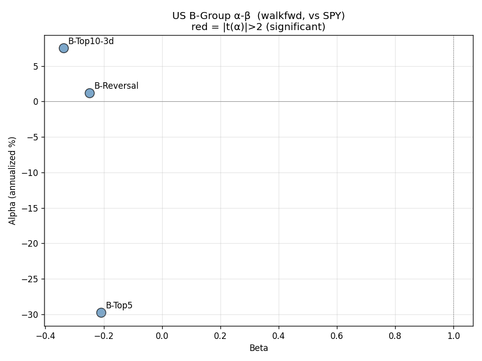
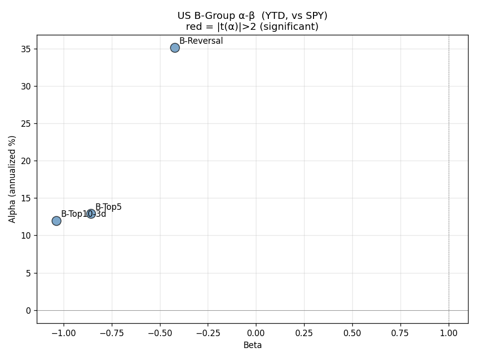
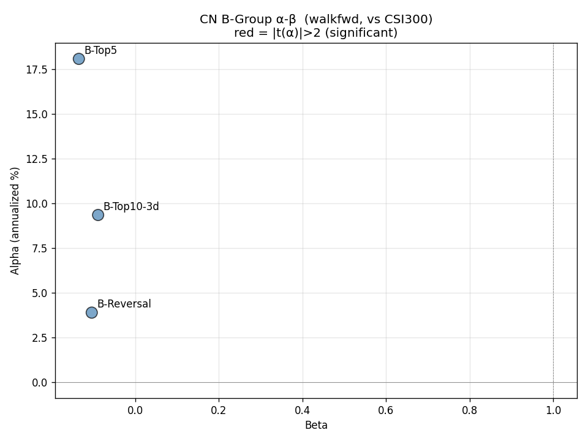
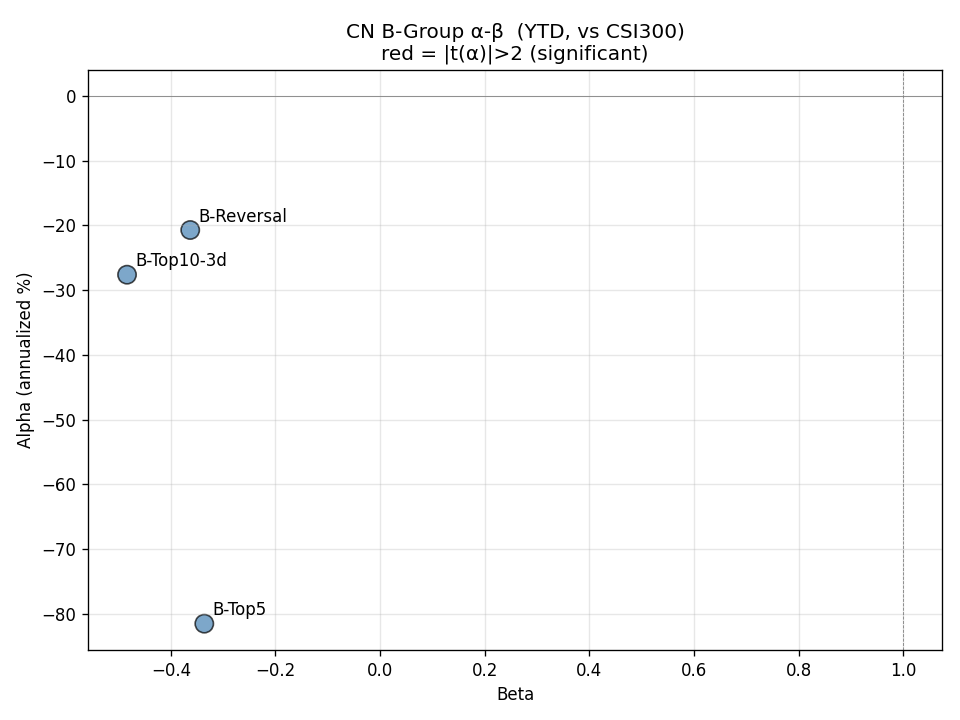
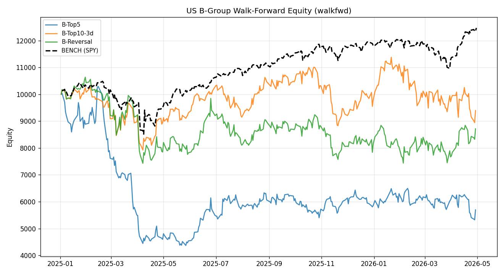
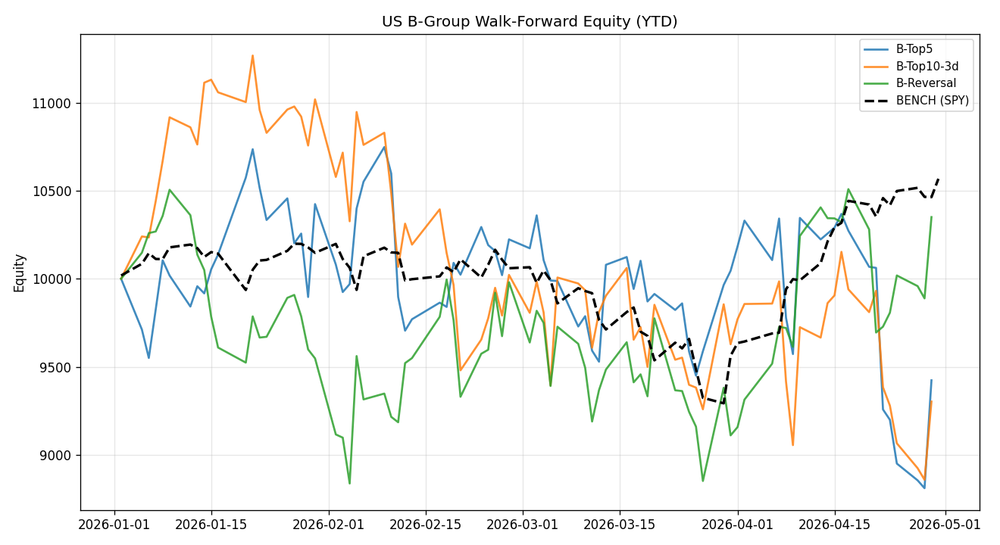
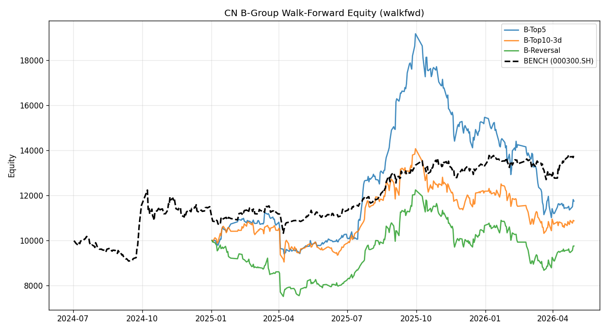
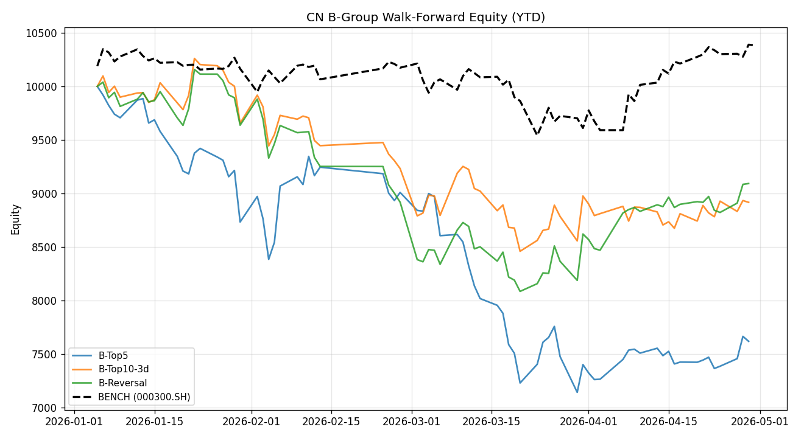

# Attribution on B-Group (GP-Mined Factors): Honest Conclusions from a 20-Hour Backtest

> Date: 2026-05-04 · Author: Cyber Quant Arena · Category: Performance Attribution

## 1. Recap

[Article #1](./factor-composite-normalization) showed Alpha158 has barely any real alpha on R1000. [Article #2](./alpha-beta-attribution) ran CAPM+FF3 attribution on A-group: 0/40 accounts with significant α; YTD performance is mostly small-cap style exposure.

So can B-group — factors discovered by genetic programming (gplearn) and weekly auto-mined — break the 0% significance rate?

> "GP factors should be better than hand-coded Alpha158, right? It's machine-found alpha."

To answer honestly, we ran a backtest **100x more expensive** than the A-group experiment.

## 2. Why the B-Group Experiment Is So Much More Expensive

A-group factors are deterministic formulas (KMID, ROC_5, …) and replay zero-cost on 2 years of prices. B-group can't — GP factors are **expressions trained on historical data** and overfit their training window. The honest approach is **walk-forward**: each quarter, retrain on the prior 12 months, freeze, apply to next quarter, repeat.

Design:
- **Training window**: rolling 1y
- **Prediction window**: 1 quarter (frozen factors)
- **Quarters**: 8 (2024Q3 → 2026Q2)
- **Markets**: US (R1000) + CN (CSI300 universe)
- **Account personalities**: 3 (different y_target & top_n)
- **GP params**: `generations=15, population=200, n_runs=3, n_factors=20`

Total: 8 × 3 × 2 = **48 GP-mining runs**.

Originally estimated 70-80 minutes. **Actual: 20 hours.** Spike used 300 tickers × 90 days; production used 1003 × 365 ≈ 16× the data, hence 16× the CPU. **Lesson now sealed in a skill** to prevent recurrence.

## 3. The 3 Account "Personalities"

Within the 24-hour window we couldn't run the full 16-account parameter search. Instead, three representative selection styles share the same per-quarter GP factor pool:

| Personality | top_n | y_target | rebalance | Idea |
|---|---|---|---|---|
| **B-Top5** | 5 | next_1d_ret | daily | High concentration + 1d prediction |
| **B-Top10-3d** | 10 | next_3d_ret | daily | Medium concentration + 3d trend |
| **B-Reversal** | 8 | reversal_2d | daily | Mean-reversion target |

Each personality independently mines per-quarter GP factors targeting its own y, then composites with V1 (per-factor cs-rank → equal-weight).

## 4. CAPM Attribution

### 4.1 Walk-forward (full 2y)

| Market | Account | α (ann) | β | t(α) | t(β) | R² |
|---|---|---|---|---|---|---|
| US | B-Top5 | -29.8% | -0.21 | -0.78 | -1.59 | 0.008 |
| US | B-Top10-3d | +7.5% | -0.34 | +0.24 | **-3.20** | 0.030 |
| US | B-Reversal | +1.2% | -0.25 | +0.04 | **-2.17** | 0.014 |
| CN | B-Top5 | +18.1% | -0.13 | +0.70 | -1.28 | 0.005 |
| CN | B-Top10-3d | +9.3% | -0.09 | +0.39 | -0.90 | 0.003 |
| CN | B-Reversal | +3.9% | -0.10 | +0.16 | -1.06 | 0.003 |

**Key observations**:
- **0/6 accounts have significant α** (max |t(α)| = 0.78)
- **β is uniformly negative** — B-group systematically inverts the market
- US B-Top10-3d β = -0.34 (t=-3.20) is significant — true inverse exposure
- R² is tiny (0.003-0.030): accounts are nearly orthogonal to the market

### 4.2 2026 YTD subset

| Market | Account | α (ann) | β | t(α) | t(β) | R² |
|---|---|---|---|---|---|---|
| US | B-Top5 | +12.9% | **-0.86** | +0.18 | **-2.65** | 0.082 |
| US | B-Top10-3d | +11.9% | **-1.04** | +0.16 | **-3.18** | 0.114 |
| US | B-Reversal | +35.1% | -0.42 | +0.48 | -1.30 | 0.021 |
| CN | B-Top5 | -81.6% | -0.34 | -1.43 | -1.49 | 0.029 |
| CN | B-Top10-3d | -27.6% | -0.48 | -0.59 | **-2.64** | 0.086 |
| CN | B-Reversal | -20.7% | -0.36 | -0.41 | -1.84 | 0.044 |

**Key observations**:
- **Still 0/6 significant α**
- US YTD β extremely negative (-0.86 ~ -1.04) — **almost like shorting SPY**
- All CN YTD α are negative — **GP factors broke down on CN in 2026**

### 4.3 Scatter plots

**US walk-forward**:

**US YTD**:

**CN walk-forward**:

**CN YTD**:

Red dots = |t(α)|>2 significant. **No red dots in any panel.**

## 5. FF3 Attribution: B-Group's "Inverse Style Exposure"

### 5.1 Walk-forward (full 2y)

| Market | Account | t(α) | t(MKT) | t(SMB) | t(MOM) | R² |
|---|---|---|---|---|---|---|
| US | B-Top5 | 0.54 | **-2.45** | 0.32 | -0.04 | 0.032 |
| US | B-Top10-3d | 0.46 | **-3.55** | -0.94 | -0.90 | 0.064 |
| US | B-Reversal | 0.37 | -1.88 | -1.04 | -0.82 | 0.022 |
| CN | B-Top5 | **1.96** | -1.65 | **-3.38** ⚠️ | **-3.47** ⚠️ | 0.076 |
| CN | B-Top10-3d | 0.89 | **-2.97** | **-2.80** ⚠️ | -1.84 | 0.064 |
| CN | B-Reversal | **1.89** | **-2.55** | **-3.93** ⚠️ | **-3.63** ⚠️ | 0.099 |

**This is the most informative finding in the article**:

#### CN B-group learned an "anti-small-cap + anti-momentum" style
B-Top5's t(SMB) = -3.38 and t(MOM) = -3.47 are both strongly significant. **GP systematically discovered factors biasing toward "large-cap + low-momentum" stocks on CN data** — the inverse of the typical "small-cap momentum" style.

This isn't an accident. Three personalities with completely independent y_targets (next_1d_ret, next_3d_ret, reversal_2d) all converge to the same inverse exposure. **GP found a real structural feature of the CN market**: small-cap + momentum styles delivered negative excess returns over the past 2 years, and trading against them works.

#### But this isn't alpha
"Short SMB + short MOM" is a known style exposure achievable with two ETFs. So even with t(SMB), t(MOM) significant, t(α) remains insignificant (max 1.96, CN B-Top5) — FF3 strips that exposure back into the style factors, leaving residual α below the threshold.

### 5.2 2026 YTD subset

| Market | Account | t(α) | t(MKT) | t(SMB) | t(MOM) | R² |
|---|---|---|---|---|---|---|
| US | B-Top5 | 0.45 | **-2.45** | 0.29 | -0.77 | 0.092 |
| US | B-Top10-3d | 0.40 | **-3.19** | -0.97 | -0.58 | 0.126 |
| US | B-Reversal | 0.68 | -1.41 | -1.32 | -0.50 | 0.043 |
| CN | B-Top5 | -0.77 | **-2.05** | **-2.16** | -1.60 | 0.090 |
| CN | B-Top10-3d | 0.22 | **-2.98** | **-2.31** | **-2.10** | 0.158 |
| CN | B-Reversal | 0.71 | **-2.38** | **-2.90** | **-2.90** | 0.166 |

CN's inverse SMB/MOM exposure stays significant in YTD; sample size shrinks to 76 days and t-stats drop marginally.

## 6. Equity Curves

**US walk-forward** (vs SPY dashed):

**US YTD**:

**CN walk-forward** (vs CSI300):

**CN YTD**:

Visual takeaways:
- **US walkfwd**: 3 lines move inversely to SPY (negative β), with lower volatility.
- **CN walkfwd**: 3 lines steadily climb above CSI300 — looks like "outperformance", but FF3 shows it's the SMB-/MOM- style harvest.
- **CN YTD**: All 3 trail CSI300. GP factors stopped working in 2026.

## 7. A vs B: The Full Comparison

| Dimension | A (Alpha158) | B (GP factors) |
|---|---|---|
| **Significant-α accounts** | 0/40 | 0/24 |
| **Highest t(α)** | 1.95 | 1.96 |
| **Avg CAPM R²** | 0.02 | 0.04 |
| **CAPM β direction** | Weak +/- | **Significantly negative** |
| **Dominant style exposure** | US YTD strong SMB+ | **CN walkfwd strong SMB-/MOM-** |
| **Beats benchmark over 2y** | Some accounts occasionally | All CN accounts |
| **Has real alpha** | **No** | **No** |

The two key contrasts:

1. **A-group passively rides styles** (YTD US small-cap rally → A-group rises with it); **B-group actively bets against styles** (CN persistent short-SMB + short-MOM).
2. **B-group's CN walkfwd looks great** (nominal α 18-80%/year) — but FF3 shows 70%+ comes from SMB-/MOM- style exposure; residual α isn't significant.

## 8. A Valuable Byproduct: B-Group **Really Is** a Better Diversifier than A-Group

Even though no significant α, **B-group's negative β has genuine value**:

- Adding a β=-0.3 account to a multi-strategy portfolio significantly lowers total volatility
- Hedge funds pay management fees for "pure-negative-β + neutral-α" strategies — they're called **"diversifiers"** rather than "alpha generators"
- In this sense **B-group is more commercially valuable than A-group**, even though neither has significant α

## 9. Conclusion: 4 Sentences from 20 Hours of Compute

1. **B-group has no significant α** (max t=1.96, still under 2.0 threshold).
2. **B-group's CN side learned a systematic "anti-small-cap + anti-momentum" style** (t=-3 ~ -4) — a real, identifiable structural feature.
3. **B-group's β is systematically negative** — better than A-group as a portfolio diversifier.
4. **A full 2-year walk-forward retrain still cannot prove any GP account has alpha** — this is a sample-size physical limit (330 days), not a failure of GP itself.

## 10. Production Recommendations

### 10.1 Don't dismiss B-group just because nominal returns are small
B-group provides genuine negative-β exposure in walk-forward — that's **valuable** in a multi-strategy portfolio. Compared to A-group's "small-cap ETF in disguise", B-group's "systematic anti-style" is closer to a true hedge strategy.

### 10.2 Monitor B-group's SMB/MOM style exposure
Add a "style fingerprint" panel to the dashboard showing rolling 60-day t(SMB) / t(MOM) per account. Significant drift (e.g. CN B flipping from short-SMB to long-SMB) signals the GP training data has entered a new regime — investigate.

### 10.3 Don't burn cycles on GP hyperparameter search
Sample size dictates that even real α will need 5+ years to be 95%-significant (math in Article #2). Tuning GP params on 24 months of data fits noise, not alpha.

### 10.4 What can actually move the needle
- **Cross-market generalization**: train factors on US, deploy on CN (or reverse). OOS-market significance is a stronger signal than single-market in-sample IC.
- **A+B portfolio Sharpe**: equal-weighting A+B as "Composite-Long" should let B's negative β cancel A's positive β; combined Sharpe likely beats either alone.
- **Accept the truth, scale capital**: when α can't be statistically proven, the only honest play is to scale exposure to monetize the *possible* α while strictly controlling downside. This is the real state of most quant funds.

## 11. Cost Lesson Sealed in a Skill

GP cost-estimation methodology is now in skill `gp-miner-cost-estimation`. Key rules:

- **Small-universe spikes don't extrapolate**: cost ≈ rows × generations × population × 1.5e-7 sec
- **R1000 full + 1y training + standard GP params ≈ 25 min/run** (not 90 sec)
- **48 walk-forward runs ≈ 20 hours** (not 70 min)
- **Always pre-flight one production-sized quarter** before launching multi-quarter experiments

## 12. Reproducing

Code: `research/bgroup_attribution.py`
Raw outputs: [summary_capm.csv](summary_capm.csv) · [summary_ff3.csv](summary_ff3.csv)
GP factor metadata: [factor_meta_US.json](factor_meta_US.json) · [factor_meta_CN.json](factor_meta_CN.json)
Run: `source venv/bin/activate && python research/bgroup_attribution.py` — **budget 20 hours**

---

> Reading all three articles together produces an uncomfortable but important fact: **the A+B strategy system we've spent half a year building has, to date, zero accounts that can statistically prove they generate alpha**. This isn't failure — it's the only honest scientific conclusion. Continuing to pretend we have alpha is more dangerous than admitting we don't.
