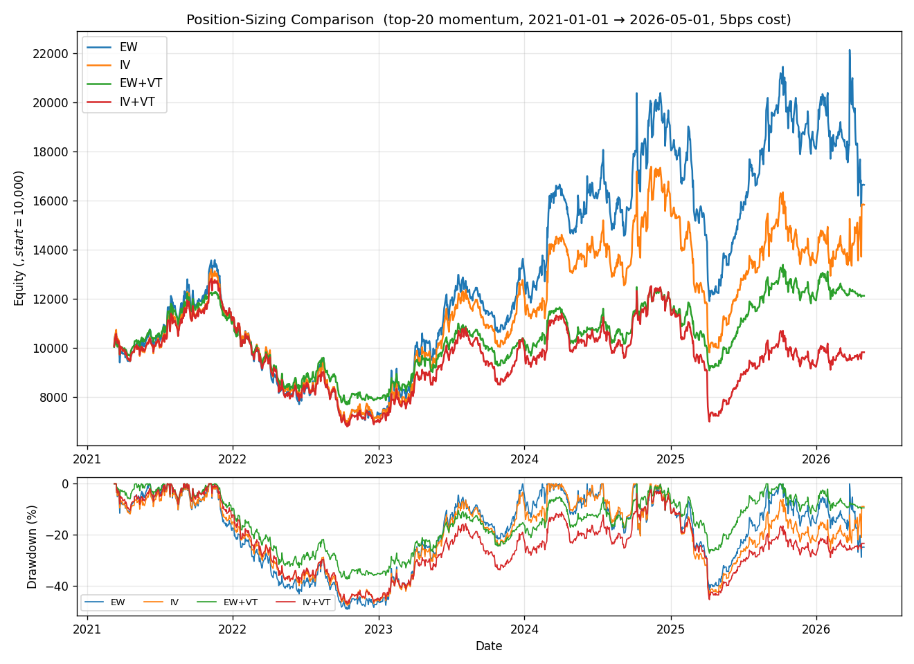

# Position Sizing: Industry Practice, A Controlled Experiment, and a Counter-Intuitive Result

> Date: 2026-05-03  ·  Author: Cyber Quant Arena  ·  Category: Risk / Portfolio Construction

## 1. The Question

In our paper-trading system, when an account decides to buy a stock, **how much money does it actually spend on it**? It looks like a trivial engineering question, but it's really about **portfolio construction** — every bit as important as the alpha signal itself in quant trading.

Our current logic (`trading/engine.py` + `main.py::_trade_*_account`) is roughly:

```
target_per_position = equity × max_position_pct
budget              = min(target − held_value,  cash × 0.95)
shares              = int(budget / price)
```

Plus a 30% single-name concentration cap at the engine level. Essentially: **equal-weight + ratio cap**.

So how does the industry actually do it? Can we just lift a more "mature" approach off the shelf?

---

## 2. The Industry Toolbox

Daily-frequency quant sizing breaks into roughly four layers, and most shops **stack them** rather than picking one.

### 2.1 Portfolio construction: how much does each name get?

| Method | Formula | Who uses it |
|---|---|---|
| **Equal-weight / Top-N** | `w_i = 1/N` | AQR, Research Affiliates legacy factor sleeves |
| **Signal-weighted** | `w_i ∝ z(α_i)` | Mid-frequency multi-factor (Barra clients) |
| **Risk parity / 1/σ** | `w_i ∝ 1/σ_i` | Bridgewater, CTA shops (AHL/Winton) |
| **Mean-Variance Optimization** | `max  μᵀw − λ·wᵀΣw` | Two Sigma, AQR, Millennium PMs |
| **Fractional Kelly** | `w* ∝ Σ⁻¹·μ` (½ or ¼) | RenTech, Two Sigma research notes |
| **Black-Litterman** | Bayesian blend of prior + alpha | Goldman AM, PIMCO |

**Key**: in MVO, μ comes from the alpha signal, but Σ comes from a **multi-factor risk model** (Barra/Axioma) — not the historical sample covariance, which is hopeless in high dimensions.

### 2.2 Risk constraints layered on top of MVO

When a real PM hits "submit", these constraints are **always** present:

- Single-name weight 2–5% (long-only) / 1–3% (long-short)
- Industry exposure ±3% vs benchmark
- Style factor exposure (Size/Value/Mom/Beta) ±0.3σ
- Portfolio Beta 0.95–1.05 (long-only) / ±0.1 (market neutral)
- Tracking error 3–6% / yr
- Gross leverage 100/100 long-short
- Position liquidity ≤ 5–10% of ADV

### 2.3 Signal → target position translations

- **Cross-sectional rank → MVO** (standard multi-factor stock-picking pipeline)
- **Time-series signal → vol target** (CTA trend): `position = signal × target_vol/σ × capital`
- **Portfolio-level vol targeting**: `leverage = target_portfolio_vol / realized_vol`
- **Risk Budgeting**: each PM/sub-strategy gets a **risk budget** (VaR or vol contribution), not a dollar allocation — the Millennium / Citadel "pod" model

### 2.4 Cost & turnover control

```
max  μᵀw − λ_risk·wᵀΣw − λ_tcost·|w − w_prev|^1.5
```

Square-root impact (Almgren-Chriss) plus turnover caps (≤ 10–20% / day). Without this layer, transaction costs typically eat half the IR of a daily strategy.

---

## 3. Experiment Design

After laying out all the theory, the real question is: **do these methods actually work on our universe and our alpha signal?**

So I designed a **clean controlled experiment**:

| Dimension | Setup |
|---|---|
| Data | `trading.db` daily, 2021-01-01 → 2026-05-01 |
| Universe | Russell 1000 names with avg dollar-volume > $5M → 2336 tickers |
| Alpha signal | 20-day momentum `ROC_20` (**identical across all schemes**) |
| Construction | Daily, top-20 long-only, hold next-day close-to-close |
| Costs | 5 bps × turnover |
| Initial capital | $10,000 |
| **Only variable** | Sizing rule |

### Four schemes compared

1. **EW** — Equal-weight (industry baseline; matches our current logic)
2. **IV** — 1/σ weighted (σ = 20-day realised vol)
3. **EW + VT** — Equal-weight + portfolio vol-targeting (target 12% ann, leverage cap 1.5×)
4. **IV + VT** — Inverse-vol + vol-targeting

VT leverage estimator (naive zero cross-correlation, used as a sizing knob only):

```
est_port_vol = sqrt(Σ wᵢ²·σᵢ²) × √252
leverage     = min(target_vol / est_port_vol, 1.5)
```

---

## 4. Running the Experiment

Implementation: [`analysis/sizing_experiment.py`](https://github.com/) — pandas-vectorised. Pivot per-ticker → cross-sectional rank → next-bar close-to-close return.

The four equity curves and drawdowns:



---

## 5. Results

| Scheme | Total Ret | Ann | Vol | Sharpe | Max DD | Calmar | Avg Turn | Avg Lev |
|---|---:|---:|---:|---:|---:|---:|---:|---:|
| **EW** (baseline) | **+66.4%** | 10.1% | 33.8% | **0.30** | -49.2% | 0.20 | 0.47 | 1.00 |
| **IV** | +58.3% | 9.1% | 31.5% | 0.29 | -47.6% | 0.19 | 0.58 | 1.00 |
| **EW + VT** | +21.3% | 3.7% | 19.5% | 0.19 | -37.3% | 0.10 | 0.34 | 0.64 |
| **IV + VT** | −1.7% | −0.3% | 24.1% | −0.01 | -46.9% | −0.01 | 0.48 | 0.86 |

**Counter-intuitive: both industry-favourite tools (InvVol, VolTargeting) lost to plain equal-weight.**

---

## 6. Interpretation

### 6.1 IV did not beat EW
1/σ weighting in theory equalises name-level risk, but in a **momentum portfolio**, momentum and high vol are strongly correlated — low-vol names just don't return as much. Down-weighting high-vol names cuts your alpha exposure. Vol barely moves (33.8% → 31.5%), drawdown barely improves, and you give up 8 percentage points of return.

### 6.2 VolTarget actively hurts
Average leverage was just **0.64** — the realised vol of a top-20 momentum book runs well above 12% almost always, so VT is constantly de-risking. Vol drops from 34% to 19.5% (yes), but annual return drops from 10% to 3.7%. **Sharpe gets worse**, not better (0.30 → 0.19).

### 6.3 IV + VT is the worst
Stack two attenuators on a thin alpha and you get noise.

---

## 7. Why Industry Wisdom Failed Here

1. **The alpha is too weak**: a 20-day momentum signal has IR ≈ 0.3. There isn't much alpha to extract. Every "smoother risk" trick just trades return for vol — Sharpe doesn't improve.
2. **Top-N momentum naturally concentrates in high-vol names** (tech, small-cap growth). Inverse-vol weighting punishes exactly the names that drive your edge.
3. **The 12% vol target is too low**: this book's "natural" vol is 30%+. Targeting 12% means sitting on cash 36% of the time on average.
4. **No short leg**: vol-targeting really earns its keep on **market-neutral long-short** books — naturally low vol with rare spikes (2008, 2020) that VT correctly de-risks. On a long-only book, VT mostly just suppresses beta, not idiosyncratic risk.

---

## 8. Takeaways and Next Experiments

Counter-intuitive but valuable:

> **Industry vol-targeting and risk weighting work because they're applied to alpha signals with IR ≥ 0.5 and Sharpe ≥ 1.0. On a Sharpe ≈ 0.3 signal, fancier risk control only dilutes the thin alpha further.**

### Recommendations for our system

- ❌ Do **not** rush to add InvVol or VolTarget to A/B accounts — it would just cost return.
- ✅ If we want risk control, **target drawdown, not vol**: e.g. account equity drops 8% → halve position size. This is asymmetric and doesn't bleed alpha.
- ✅ The highest-ROI direction remains **alpha quality** (sharper Q-series predictions, longer GP training windows), not sizing.
- ✅ If we ever build a long-short book, revisit vol-targeting then.

### Future experiments

- **EW vs EW + Drawdown Stop** (account-level circuit breaker)
- **Top-N momentum vs Top-N multi-factor** — get Sharpe to 0.5+ first, then revisit risk control
- **Long-only vs market-neutral** — does VT start helping once IR improves?

---

*Experiment script: `~/quant-trading/analysis/sizing_experiment.py`  ·  Raw results: `/tmp/hermes/sizing_exp/summary.csv`*
